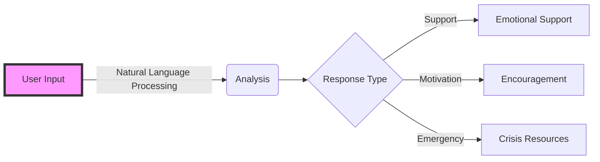

# Hello, fellow developers! 👋 
<div align="center">
  
</div>

<div align="center">
  
[](https://github.com/YourUsername)
[](https://www.python.org)
[](https://core.telegram.org/bots)

</div>

## 🤖 Who Am I?
```python
class Developer:
    def __init__(self):
        self.name = "YourName"
        self.role = "AI Developer"
        self.language_spoken = ["Python", "C++", "Human"]
        self.current_focus = "AI-Powered Mental Health Support"
    
    def say_hi(self):
        print("Thanks for dropping by! Let's create something meaningful together!")

me = Developer()
me.say_hi()
```

## 📊 My GitHub Stats
<div align="center">
  
  
</div>

## 🎮 Let's Play a Game!
<div align="center">
  
</div>

## 🚀 Featured Project: AI Therapy Bot
<div align="center">
  
</div>

### Key Features:


## 💻 Tech Stack Animation
<div align="center">
  
</div>

### Languages and Tools:
<div align="center">
  
  
  
</div>

## 🎯 Weekly Development Breakdown
```text
Python      █████████████████░░░░░   70.00 % 
C++         ██░░░░░░░░░░░░░░░░░░░   10.00 % 
AI/ML       ████░░░░░░░░░░░░░░░░░   20.00 % 
```

## 🌐 Connect With Me
<div align="center">
  <a href="https://github.com/YourUsername" target="_blank">
    
  </a>
  <a href="https://t.me/YourTelegramBot" target="_blank">
    
  </a>
</div>

## 🎵 Currently Coding To
<div align="center">
  
</div>

<div align="center">
  
  
  ### Visitors Count
</div>

---
⭐️ From [YourUsername](https://github.com/YourUsername)

<!-- Snake animation -->
<div align="center">
  
</div>
